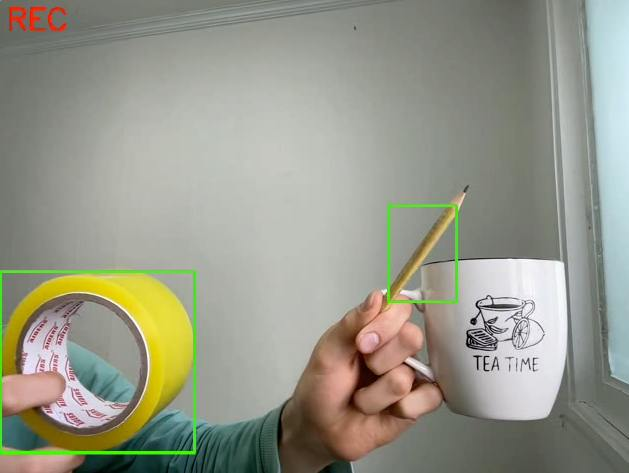

# Color Detection

Real-time color detection system using computer vision to identify and track colors.

## Features

- Two detection modes:
  - [Custom color detection](main.py)
  - [16 web colors detection](limited_colors.py)
- Real-time object tracking
- Video recording capability
- HSV color space optimization

## Requirements

- opencv-python>=4.8.0
- numpy>=1.23.4,<2.0.0

Install these dependencies using:

```bash
pip install -r requirements.txt
```

## Quick Start

1. Clone repository
2. Install dependencies
3. Choose detection mode:

```bash
# Custom color detection
python main.py

# Web colors detection
python limited_colors.py
```

## Project Structure

- [`main.py`](main.py): Custom color detection implementation
- [`limited_colors.py`](limited_colors.py): Web colors detection system
- [`util.py`](util.py): Color range definitions and utilities
- `output/`: Recorded video storage

## Code Examples

```python
# Custom color detection
from main import main
main([0, 255, 255], save=True)  # Yellow in BGR

# Web colors detection
from limited_colors import main
main('yellow', save=True)
```

## Controls

- `r`: Start/stop recording
- `q`: Quit application

## Example


